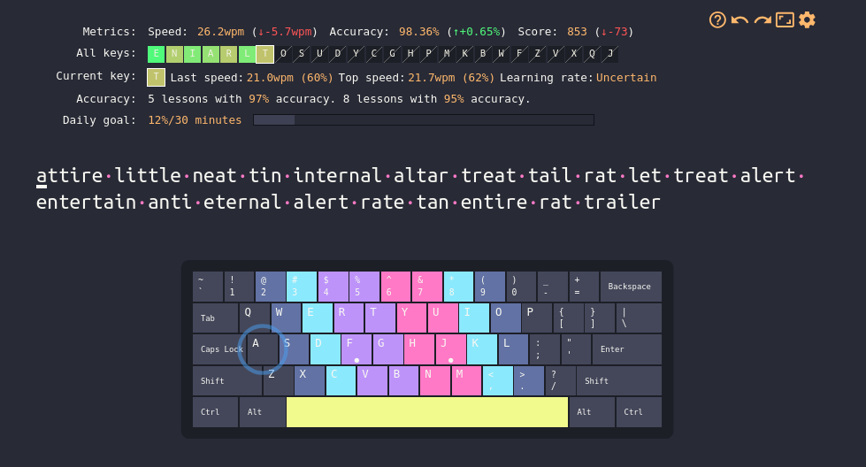

# Dracula for [keybr](https://keybr.com)

> A dark theme for [keybr](https://keybr.com). Keybr helps you type faster or learn a new keyboard layout. It counts your wpm (words per minute) and helps you to get better. 

## Install

All instructions can be found at [draculatheme.com/keybr](https://draculatheme.com/keybr).

## Team

This theme is maintained by the following person(s) and a bunch of [awesome contributors](https://github.com/dracula/foobar/graphs/contributors).

|  | 
| --------------------------------------------------------------------------------------------- |
| [0x17](https://github.com/nerdbude)                                              |

## Community

- [Twitter](https://twitter.com/draculatheme) - Best for getting updates about themes and new stuff.
- [GitHub](https://github.com/dracula/dracula-theme/discussions) - Best for asking questions and discussing issues.
- [Discord](https://draculatheme.com/discord-invite) - Best for hanging out with the community.

## Dracula PRO

## License

[MIT License](./LICENSE)
